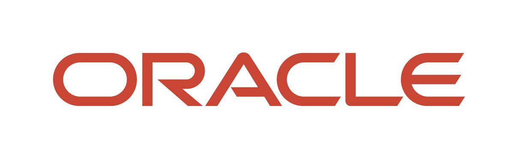

# 🚀 DeepDive Workshop OCI 2026
### AI Data Platform (AIDP) + AI Database Agent Factory

*Un workshop end‑to‑end para construir una plataforma de datos moderna e inteligente sobre Oracle Cloud Infrastructure, integrando **AI Data Platform** y **AI Database Private Agent Factory**.*

---
## 📖 Acerca de este workshop

Este workshop introduce conceptos de modelado y gobernanza de datos utilizando las capacidades de AIDP, una plataforma empresarial diseñada para construir aplicaciones de IA transformacionales. Durante la sesión, trabajaremos en la unificación, simplificación y transformación de datos para crear un modelo predictivo de los resultados de la Copa del Mundo.

En el workshop aprenderás a implementar el flujo de un agente con AI Agent Factory de forma rápida. Los participantes configurarán una base de datos Oracle AI Database, que permitirá al agente interactuar visualmente y responder preguntas sobre estadísticas históricas de la Copa del Mundo. El laboratorio cubre temas clave como: data ingestion, data search y retrieval.

Trabajaremos con dos productos estrella del stack de IA de Oracle:

| Producto | Descripción |
|---|---|
| 🧩 **Oracle AI Data Platform (AIDP)** | Plataforma unificada para ingesta, catalogación, workflows de datos, notebooks y agentes inteligentes. |
| 🤖 **Oracle AI Database Private Agent Factory (DPAF)** | Factoría de agentes privados desplegada en tu tenancy, con Agent Builder visual, RAG y Text‑to‑SQL sobre Oracle Database 26ai. |

> 💡 **Pre‑requisito:** acceso activo a una consola de **Oracle Cloud Infrastructure** con permisos en el compartment donde se desplegarán los servicios.

---
## 🎯 Objetivos de aprendizaje

Al finalizar, serás capaz de:

- Aprovisionar una **Autonomous AI Database 26ai** y una instancia de **AI Data Platform** desde cero.
- Ingestar datos en Autonomous mediante `DBMS_CLOUD` y en AIDP mediante catálogos externos y estándar.
- Organizar información siguiendo la arquitectura medallón (**Bronze → Silver → Gold**).
- Ejecutar notebooks de laboratorio en un **cluster de AIDP**.
- Desplegar **AI Database Private Agent Factory** desde OCI Marketplace.
- Construir un **Data Analysis Agent** para Text‑to‑SQL sin escribir código.
- Diseñar un flujo conversacional en **Agent Builder** conectado a una base de datos real.

---

## 🗺️ Arquitectura de la solución

---

## 🧭 Tabla de contenidos

Dividimos la ejecución del workshop en los siguientes laboratorios:

 - 🧱 [Lab 1 - AI Ready Architecture ](/Lab%201%20-%20AI%20Ready%20Architecture%20)
 - 📥 [Lab 2 - Predictive AI and Natural Language](/Lab%202%20-%20Predictive%20AI%20and%20Natural%20Language)
 - 🤖 [Lab 3 - Building Intelligent Agents](/Lab%203%20-%20Building%20Intelligent%20Agents%20)
   

